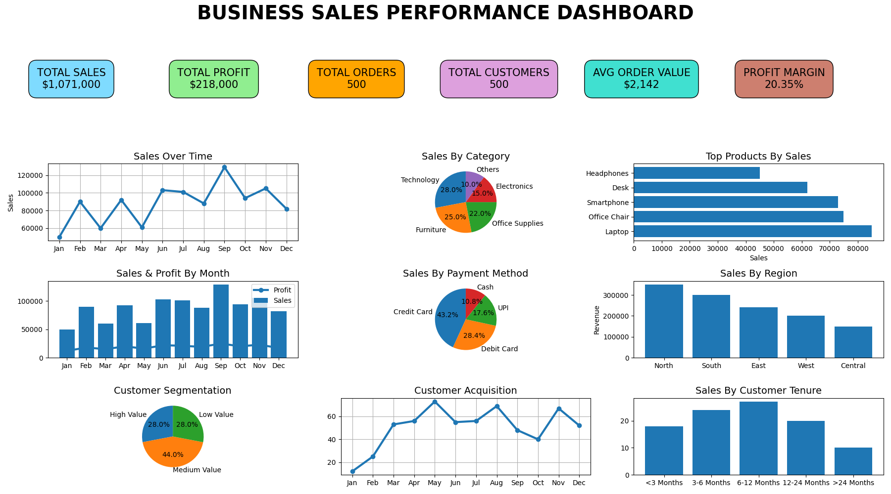

# Business Sales Performance Dashboard

A professional Business Sales Performance Dashboard created using Python, Matplotlib, and NumPy.

---

# Project Overview

This dashboard helps analyze business performance using charts, KPIs, and data visualization techniques.

The dashboard includes:
- Total Sales
- Total Profit
- Total Orders
- Total Customers
- Average Order Value
- Profit Margin
- Sales Analysis
- Customer Insights
- Product Performance
- Regional Sales Analysis

---

# Technologies Used

- Python
- Matplotlib
- NumPy

---

# Dashboard Features

## KPI Summary Cards
- Total Sales
- Total Profit
- Total Orders
- Total Customers
- Average Order Value
- Profit Margin

## Visualizations
- Sales Over Time
- Sales by Category
- Top Products by Sales
- Sales and Profit Analysis
- Sales by Payment Method
- Sales by Region
- Customer Segmentation
- Customer Acquisition
- Customer Tenure Analysis

---

# Project Structure

```text
Business-Sales-Performance-Dashboard/
│
├── dashboard.py
├── README.md
└── output.png
```

---

# Installation

Install required libraries:

```bash
pip install matplotlib numpy
```

---

# Run the Project

```bash
python dashboard.py
```

---

# Dashboard Output

Add your dashboard screenshot as:

```text
output.png
```

Then display image using:

```md

```

---

# Author

Anushka

---

# GitHub Repository

Repository Name:

```text
Business-Sales-Performance-Dashboard
```

---

# License

This project is created for educational and learning purposes.